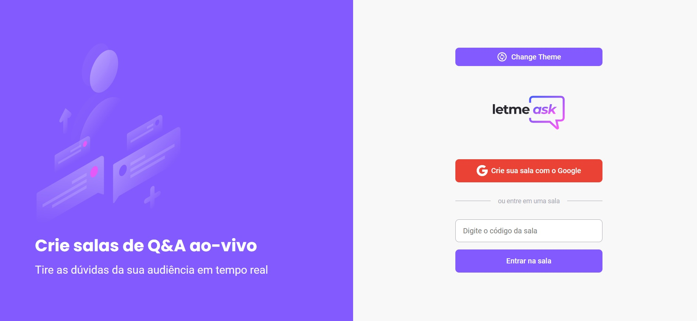

# Letmeask

### Built With

- [React]
- [Typescript]
- [SASS]
- [Firebase]

## Features

O App Letmeask foi desenvolvido durante a NLW Together da Rocketseat. É basicamente uma aplicação de perguntas e respostas em tempo real.
- Admin e usuários comuns;
- Cadastro via autenticação Google através do Firebase;
- Usuários comuns podem realizar perguntas e dar Likes;
- Admin pode destacar e excluir perguntas;
- Entre outras funções.
